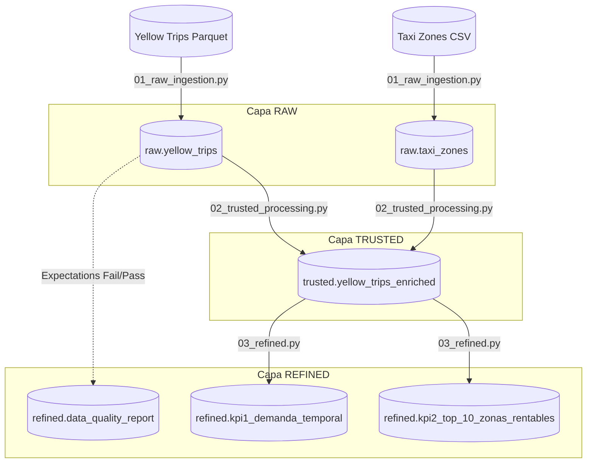

# 🚖 NYC Taxi ETL Pipeline - Medallion Architecture

Este repositorio contiene la implementación de un pipeline de datos end-to-end utilizando **Azure Databricks**, **PySpark**, y **Unity Catalog**. El proyecto procesa los datos públicos de los viajes de taxi de la ciudad de Nueva York (Yellow Taxi) aplicando el patrón de diseño Medallion (Raw, Trusted, Refined).

## 🏛️ Arquitectura de Datos (Linaje)

El siguiente diagrama ilustra el flujo de los datos a través de las diferentes capas del Data Lakehouse:

## 🛠️ Stack Tecnológico
* **Cloud Provider:** Microsoft Azure
* **Procesamiento:** Azure Databricks (PySpark)
* **Gobierno de Datos:** Unity Catalog
* **Orquestación y CI/CD:** Databricks Asset Bundles (DABs)
* **Formato de Almacenamiento:** Delta Lake

## 📁 Estructura del Proyecto

* `src/pipelines/`: Contiene los scripts de PySpark para cada capa Medallion.
* `src/utils/`: Funciones transversales (ej. custom logger).
* `docs/`: Documentación de Gobierno de Datos (Glosario, CDEs).
* `databricks.yml`: Infraestructura como Código (IaC) para la orquestación del Job.

## 🚀 Cómo ejecutar este proyecto

Este pipeline utiliza Databricks Asset Bundles para su despliegue, asegurando prácticas de CI/CD. Para ejecutarlo desde la terminal:

1. Validar la configuración del bundle:
   `databricks bundle validate`
2. Desplegar los artefactos en el Workspace (Entorno Dev):
   `databricks bundle deploy`
3. Lanzar la ejecución del pipeline:
   `databricks bundle run nyc_taxi_pipeline`

## 🛡️ Gobierno y Calidad de Datos
Se implementaron validaciones de calidad de datos *(Expectations)* en la capa Trusted para garantizar la integridad de los KPIs. Los registros anómalos (fechas incongruentes, distancias o tarifas en cero) son apartados y contabilizados en la tabla de auditoría `refined.data_quality_report`.