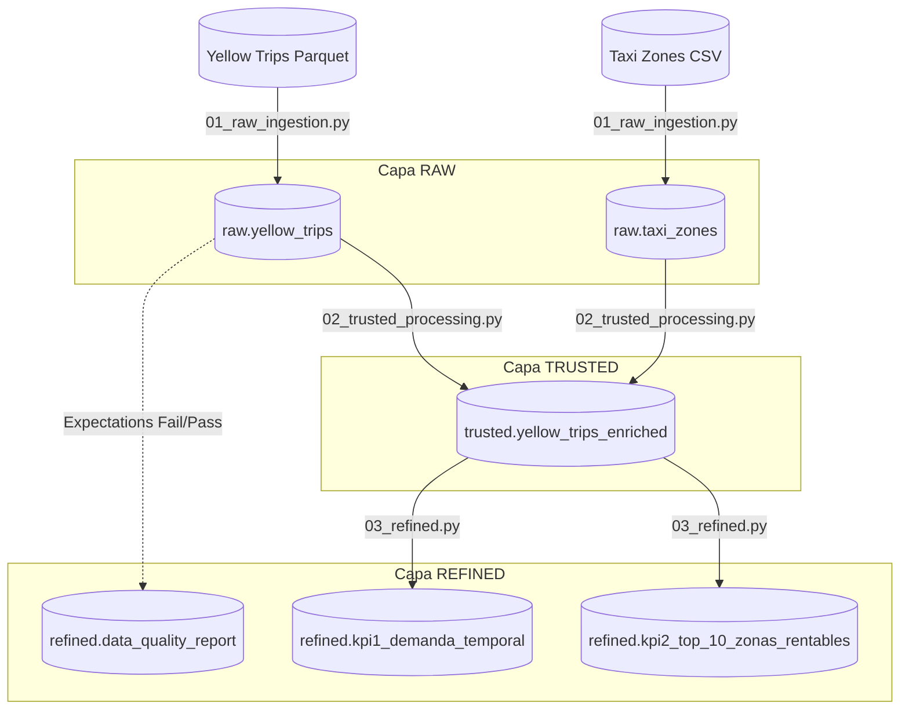

# 🚖 NYC Taxi ETL Pipeline - Medallion Architecture

Este repositorio contiene la implementación de un pipeline de datos end-to-end utilizando **Azure Databricks**, **PySpark**, y **Unity Catalog**. El proyecto procesa los datos públicos de los viajes de taxi de la ciudad de Nueva York (Yellow Taxi) aplicando el patrón de diseño Medallion (Raw, Trusted, Refined).

## 🏛️ Arquitectura de Datos (Linaje)

El siguiente diagrama ilustra el flujo de los datos a través de las diferentes capas del Data Lakehouse:



## 🛠️ Stack Tecnológico
* **Cloud Provider:** Microsoft Azure
* **Procesamiento:** Azure Databricks (PySpark)
* **Gobierno de Datos:** Unity Catalog
* **Orquestación y CI/CD:** Databricks Asset Bundles (DABs)
* **Formato de Almacenamiento:** Delta Lake

## 📁 Estructura del Proyecto

* `src/pipelines/`: Contiene los scripts de PySpark para cada capa Medallion.
* `src/utils/`: Funciones transversales (ej. custom logger).
* `docs/`: Documentación de Gobierno de Datos (Glosario, CDEs).
* `databricks.yml`: Infraestructura como Código (IaC) para la orquestación del Job.


## 🚀 Guía de Ejecución Paso a Paso

Este proyecto utiliza **Databricks Asset Bundles (DABs)**  asegurando prácticas de CI/CD, permitiendo desplegar la infraestructura y el código directamente desde la terminal.

### 📋 Prerrequisitos

1. **Suscripción de Azure**: Cuenta activa con permisos suficientes para administrar recursos de Databricks y Storage Accounts.
2. **Databricks Workspace**: Un workspace configurado con **Unity Catalog** habilitado en la región correspondiente.
3. **Databricks CLI**: Instalada la versión `v0.205.0` o superior en tu máquina local.
4. **Autenticación**: Haber configurado un perfil de autenticación que permita a la CLI interactuar con el Workspace.

---

### ☁️ Paso 0: Configuración del Storage Account en Azure

Para que Unity Catalog pueda persistir los datos del catálogo `nyc_taxi_ivan`, se requiere un contenedor con capacidades de **Data Lake Storage Gen2**.

1. **Crear Storage Account:**
   * Crea un recurso de tipo *Storage Account* en el mismo grupo de recursos que tu Workspace de Databricks.
   * **Importante:** En la pestaña "Advanced", asegúrate de marcar la opción **"Enable hierarchical namespace"**.

2. **Configurar el Contenedor:**
   * Crea un contenedor llamado `unity-catalog-storage`.
   * En el menú de **Access Control (IAM)** del Storage Account, asigna a tu usuario o al *Managed Identity* de Databricks el rol de:
     * **Storage Blob Data Contributor**.

3. **Vincular a Unity Catalog (Opcional si usas catálogos gestionados):**
   * Si deseas que el catálogo sea externo, asegúrate de tener los permisos de `CREATE EXTERNAL LOCATION` en el Metastore de Databricks para apuntar a la ruta: 
     `abfss://unity-catalog-storage@<tu_storage_account>.dfs.core.windows.net/`

### Paso 1: Autenticación
Autentícate en tu Workspace de Databricks utilizando la CLI:

 ```bash
databricks auth login --host <URL-DE-TU-WORKSPACE-AZURE>
 ```

### Paso 2: Clonar el repositorio
Clona este repositorio en tu entorno local e ingresa a la carpeta del proyecto:

 ```bash
git clone https://github.com/ivangalindoangulo/nyc_taxi_etl.git
cd nyc_taxi_etl
 ```

### Paso 3: Validación del Bundle
Verifica que la configuración de la infraestructura sea válida sintácticamente:

 ```bash
databricks bundle validate
 ```

Nota: El archivo databricks.yml está configurado para utilizar un clúster Single Node (num_workers: 0) para optimizar costos de cómputo en la nube.

### Paso 4: Despliegue (Deploy)
Sincroniza el código local y las configuraciones del Job hacia el entorno de desarrollo (dev) en Databricks:

 ```bash
databricks bundle deploy -t dev
 ```

### Paso 5: Ejecución del Pipeline (Run)
Lanza la orquestación del pipeline completo. Esto encenderá el clúster, ejecutará secuencialmente las tareas 01_raw_ingestion, 02_trusted_processing y 03_refined, y finalmente apagará el clúster.

 ```bash
databricks bundle run nyc_taxi_pipeline -t dev
 ```


## 🛡️ Gobierno y Calidad de Datos
Se implementaron validaciones de calidad de datos *(Expectations)* en la capa Trusted para garantizar la integridad de los KPIs. Los registros anómalos (fechas incongruentes, distancias o tarifas en cero) son apartados y contabilizados en la tabla de auditoría `refined.data_quality_report`.


## ⚠️ Limitaciones Conocidas (Infraestructura)

El pipeline está diseñado bajo los estándares de **Unity Catalog** y orquestado mediante **Databricks Asset Bundles (DABs)**. No obstante, existen restricciones externas que deben considerarse para la ejecución:

* **Restricciones de Cuota de Azure:** La suscripción *Free Trial* de Azure impone un límite estricto de **4 vCPUs** por región. 
* **Configuración del Compute:** El archivo `databricks.yml` utiliza un tipo de instancia `Standard_DS3_v2` (4 núcleos). Debido a que Azure reserva parte de la cuota para la gestión de la máquina virtual, existe una alta probabilidad de que el proveedor de nube rechace la creación del clúster por insuficiencia de cores disponibles.
* **Modo de Acceso:** Para ser compatible con Unity Catalog, el clúster debe estar en modo `SINGLE_USER` pues puede generar errores de despliegue de infraestructura. En entornos de producción con cuotas estándar, esto no representa un problema.

> **Solución recomendada:** En caso de fallo por cuota, se sugiere intentar el despliegue en una región con menor demanda o solicitar un incremento de cuota de la familia de VMs *Standard DSv2* en el portal de Azure.