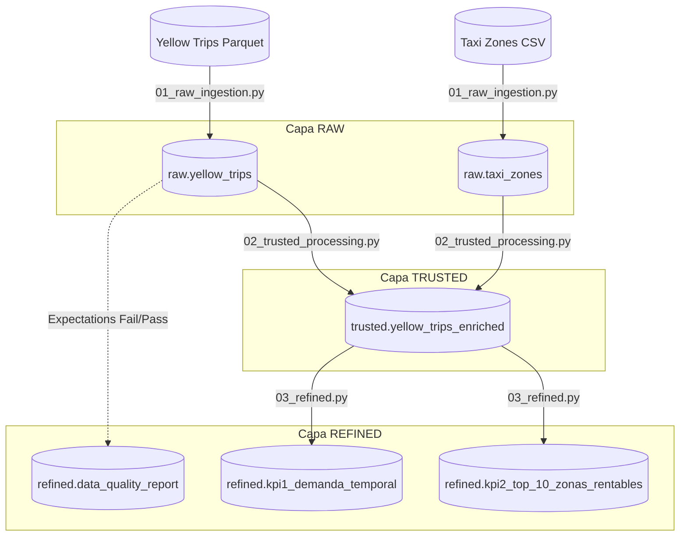

# 🚖 NYC Taxi ETL Pipeline - Medallion Architecture

Este repositorio contiene la implementación de un pipeline de datos end-to-end utilizando **Azure Databricks**, **PySpark**, y **Unity Catalog**. El proyecto procesa los datos públicos de los viajes de taxi de la ciudad de Nueva York (Yellow Taxi) aplicando el patrón de diseño Medallion (Raw, Trusted, Refined).

## 🏛️ Arquitectura de Datos (Linaje)

El siguiente diagrama ilustra el flujo de los datos a través de las diferentes capas del Data Lakehouse:

## 🛠️ Stack Tecnológico
* **Cloud Provider:** Microsoft Azure
* **Procesamiento:** Azure Databricks (PySpark)
* **Gobierno de Datos:** Unity Catalog
* **Orquestación y CI/CD:** Databricks Asset Bundles (DABs)
* **Formato de Almacenamiento:** Delta Lake

## 📁 Estructura del Proyecto

* `src/pipelines/`: Contiene los scripts de PySpark para cada capa Medallion.
* `src/utils/`: Funciones transversales (ej. custom logger).
* `docs/`: Documentación de Gobierno de Datos (Glosario, CDEs).
* `databricks.yml`: Infraestructura como Código (IaC) para la orquestación del Job.

## 🚀 Guía de Ejecución Paso a Paso

Este proyecto utiliza **Databricks Asset Bundles (DABs)**  asegurando prácticas de CI/CD, permitiendo desplegar la infraestructura y el código directamente desde la terminal.

### 📋 Prerrequisitos

1. **Databricks CLI**: Tener instalada la versión más reciente de la CLI de Databricks (`v0.205.0` o superior).
2. **Autenticación**: Un *Personal Access Token* (PAT) o autenticación M2M configurada hacia tu Workspace de Azure Databricks.
3. **Unity Catalog**: Un catálogo habilitado (el proyecto usa el nombre de catálogo definido en el archivo `databricks.yml`).

---

### Paso 1: Autenticación
Autentícate en tu Workspace de Databricks utilizando la CLI:

databricks auth login --host <URL-DE-TU-WORKSPACE-AZURE>

### Paso 2: Clonar el repositorio
Clona este repositorio en tu entorno local e ingresa a la carpeta del proyecto:

`git clone https://github.com/ivangalindoangulo/nyc_taxi_etl.git`
`cd nyc_taxi_etl`

### Paso 3: Validación del Bundle
Verifica que la configuración de la infraestructura sea válida sintácticamente:

`databricks bundle validate`

Nota: El archivo databricks.yml está configurado para utilizar un clúster Single Node (num_workers: 0) para optimizar costos de cómputo en la nube.

### Paso 4: Despliegue (Deploy)
Sincroniza el código local y las configuraciones del Job hacia el entorno de desarrollo (dev) en Databricks:

`databricks bundle deploy -t dev`

### Paso 5: Ejecución del Pipeline (Run)
Lanza la orquestación del pipeline completo. Esto encenderá el clúster, ejecutará secuencialmente las tareas 01_raw_ingestion, 02_trusted_processing y 03_refined, y finalmente apagará el clúster.

`databricks bundle run nyc_taxi_pipeline -t dev`

## 🛡️ Gobierno y Calidad de Datos
Se implementaron validaciones de calidad de datos *(Expectations)* en la capa Trusted para garantizar la integridad de los KPIs. Los registros anómalos (fechas incongruentes, distancias o tarifas en cero) son apartados y contabilizados en la tabla de auditoría `refined.data_quality_report`.